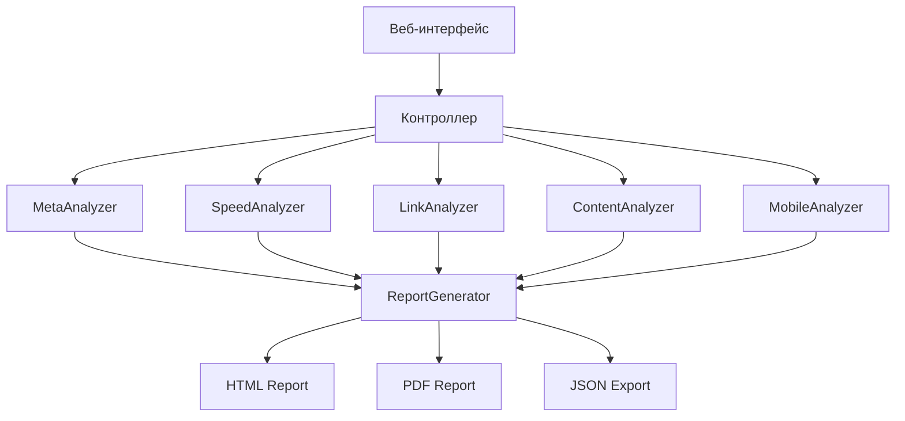

# SEO Audit Tool - Документация проекта

## Обзор проекта

**SEO Audit Tool** - это веб-приложение для комплексного SEO аудита сайтов. Приложение предоставляет детальный анализ различных аспектов оптимизации сайта для поисковых систем.

## Архитектура проекта

### Общая структура

```
seo-audit-tool/
├── docs/                    # Документация
│   ├── Project.md          # Основная документация проекта
│   ├── changelog.md        # Журнал изменений
│   └── tasktracker.md      # Трекер задач
├── src/                    # Исходный код
│   ├── app/               # Основное приложение
│   │   ├── __init__.py    # Инициализация Flask приложения
│   │   ├── routes.py      # Маршруты веб-приложения
│   │   ├── models.py      # Модели данных
│   │   └── utils/         # Утилиты
│   ├── seo_analyzer/      # Модули анализа
│   │   ├── meta_analyzer.py    # Анализ мета-тегов
│   │   ├── speed_analyzer.py   # Проверка скорости
│   │   ├── link_analyzer.py    # Анализ ссылок
│   │   ├── content_analyzer.py # Анализ контента
│   │   └── mobile_analyzer.py  # Мобильная адаптивность
│   └── reports/           # Генерация отчетов
│       ├── generator.py   # Генератор отчетов
│       └── templates/     # Шаблоны отчетов
├── templates/             # HTML шаблоны
├── static/               # Статические файлы
│   ├── css/
│   ├── js/
│   └── images/
├── tests/                # Тесты
│   ├── unit/            # Модульные тесты
│   ├── integration/     # Интеграционные тесты
│   └── fixtures/        # Тестовые данные
└── requirements.txt      # Зависимости Python
```

## Основные компоненты

### 1. Веб-интерфейс (Flask)
- **routes.py** - обработка HTTP запросов
- **templates/** - HTML шаблоны с использованием Jinja2
- **static/** - CSS, JavaScript, изображения

### 2. SEO Анализаторы
- **MetaAnalyzer** - анализ title, description, keywords
- **SpeedAnalyzer** - проверка скорости загрузки
- **LinkAnalyzer** - анализ внутренней/внешней структуры ссылок
- **ContentAnalyzer** - анализ контента и семантики
- **MobileAnalyzer** - проверка мобильной адаптивности

### 3. Система отчетов
- Генерация HTML/PDF отчетов
- Визуализация результатов анализа
- Экспорт данных в различные форматы

## Технологии

### Backend
- **Python 3.8+**
- **Flask** - веб-фреймворк
- **Requests** - HTTP клиент
- **BeautifulSoup4** - парсинг HTML
- **Selenium** - автоматизация браузера для JavaScript сайтов
- **Gunicorn** - WSGI сервер для продакшена

### Frontend
- **HTML5/CSS3** - разметка и стили
- **JavaScript** - интерактивность
- **Bootstrap** - CSS фреймворк (опционально)

### Развертывание на DigitalOcean
- **DO App Platform** - для бессерверного развертывания
- **DO Droplets** - для традиционного развертывания
- **Docker** - контейнеризация для переносимости

### Тестирование
- **pytest** - фреймворк для тестирования
- **unittest** - встроенные тесты Python
- **Selenium** - UI тестирование

## Принципы разработки

### SOLID принципы
1. **Single Responsibility** - каждый класс имеет одну ответственность
2. **Open/Closed** - код открыт для расширения, закрыт для модификации
3. **Liskov Substitution** - подтипы могут заменять базовые типы
4. **Interface Segregation** - клиенты не зависят от неиспользуемых интерфейсов
5. **Dependency Inversion** - зависимости от абстракций, не от конкретных реализаций

### KISS и DRY
- **KISS**: Keep It Simple, Stupid - простые решения
- **DRY**: Don't Repeat Yourself - избегать дублирования кода

## Процесс разработки

1. **Планирование** - определение требований и архитектуры
2. **Разработка** - написание кода согласно принципам
3. **Тестирование** - модульные и интеграционные тесты
4. **Документирование** - обновление документации
5. **Code Review** - проверка качества кода

## Функциональные требования

### Основные функции
- [ ] Анализ мета-тегов (title, description, keywords)
- [ ] Проверка скорости загрузки страниц
- [ ] Анализ структуры внутренних ссылок
- [ ] Проверка наличия sitemap.xml и robots.txt
- [ ] Анализ мобильной адаптивности
- [ ] Проверка HTTPS и SSL сертификатов
- [ ] Анализ контента на предмет SEO оптимизации

### Дополнительные функции
- [ ] Генерация подробных отчетов
- [ ] Экспорт результатов в PDF
- [ ] Планирование регулярных аудитов
- [ ] API для интеграции с другими системами

## Нефункциональные требования

### Производительность
- Время анализа одной страницы: < 30 секунд
- Поддержка одновременного анализа нескольких сайтов
- Оптимизация использования памяти

### Безопасность
- Валидация входных данных
- Защита от XSS и CSRF атак
- Безопасное хранение конфиденциальных данных

### Масштабируемость
- Модульная архитектура для легкого расширения
- Поддержка плагинов для новых анализаторов
- RESTful API для интеграции

## Диаграмма компонентов



## План развития

### Этап 1: MVP (Minimum Viable Product)
- Базовый веб-интерфейс
- Анализ мета-тегов
- Простая генерация отчетов

### Этап 2: Расширение функционала
- Анализ скорости загрузки
- Проверка мобильной адаптивности
- Улучшенная система отчетов

### Этап 3: Продвинутые возможности
- Анализ контента
- API для интеграции
- Планировщик аудитов

## Команда проекта

- **Разработчик**: AI Assistant
- **Архитектор**: AI Assistant
- **Тестировщик**: AI Assistant
- **Документатор**: AI Assistant

## Развертывание на DigitalOcean

### DO App Platform
Для бессерверного развертывания приложение будет настроено с:
- **app-spec.yaml** - спецификация приложения для DO
- **Procfile** - команды запуска для разных сред
- **requirements.txt** - зависимости Python
- **runtime.txt** - версия Python

### Структура для DO
```
seo-audit-tool/
├── src/
├── app-spec.yaml       # DO App Platform конфигурация
├── Procfile           # Команды запуска
├── requirements.txt   # Python зависимости
├── runtime.txt       # Версия Python
└── Dockerfile        # Docker контейнер (опционально)
```

### Конфигурация DO App Platform
```yaml
# app-spec.yaml
name: seo-audit-tool
services:
- name: web
  github:
    repo: username/seo-audit-tool
    branch: main
  run_command: gunicorn --bind 0.0.0.0:$PORT src.app:app
  instance_count: 1
  instance_size_slug: basic-xxs
  envs:
  - key: FLASK_ENV
    value: production
```

## Контакты и поддержка

Для вопросов и предложений по проекту обращайтесь к разработчику.
